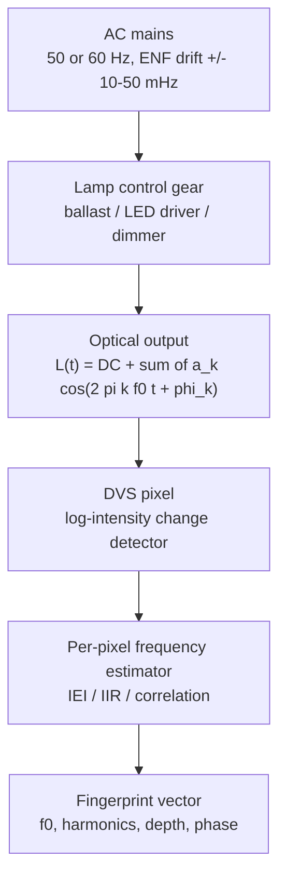

# Literature Review: Where Ceiling-Lamp Flicker Frequencies Come From, and Using an Event Camera to Measure Them

**Scope.** This review answers a narrower question than [LITERATURE_REVIEW.md](LITERATURE_REVIEW.md),
which surveys *localization*. Here the question is upstream of that:

> What physically sets the flicker frequency of an overhead luminaire, which of those
> frequency components are discriminative between fixtures, and what is the state of the art
> in using an event camera (DVS) as the instrument that measures them?

If the frequency components a lamp emits are all locked to the grid, no amount of sensor
resolution will separate two lamps. So the generation mechanism decides whether the whole
fingerprinting idea is viable. Section 2 is therefore the load-bearing part of this document.

**Provenance note.** Every reference in §8 was resolved against OpenAlex, Crossref or the arXiv
API while writing this document; DOIs/arXiv IDs are given verbatim. Citation counts, where
quoted, are OpenAlex values at time of writing and drift. Standards in §5 are cited by title and
number only — the numeric limits inside them are deliberately **not** reproduced here, read the
standard.

---

## 1. The measurement chain in one picture

The generation side (GRID -> DRV -> OPT) is §2. The sensing side (PIX -> EST) is §4.
Everything discriminative lives in what DRV adds that GRID did not already impose.

---

## 2. Frequency generation: what actually makes a luminaire flicker

### 2.1 The mains-locked family — present in almost every fixture, and useless as an identifier

Any lamp whose luminous flux tracks the instantaneous mains power emits a dominant component
at **twice the line frequency** — 100 Hz on a 50 Hz grid, 120 Hz on 60 Hz — because the light
follows $|v(t)|$ or $v(t)^2$, and both have period $T_{line}/2$. Even harmonics at
200/240 Hz, 300/360 Hz follow, with amplitudes set by how non-sinusoidal the drive current is.

This is the single most-reported observation in the flicker literature and is confirmed
independently from the event-camera side: Wang, Yuan, Ng and Mahony characterise fluorescent
and LED flicker in a DVS stream precisely as a periodic ON/OFF event burst train at the
line-doubled rate with a harmonic tail, and build a linear comb filter to *remove* it
[arXiv:2205.08090, ICRA 2022].

**Critical consequence for fingerprinting.** $2f_{line}$ is common to every fixture in the
building, phase-locked through the distribution network. Two lamps cannot be told apart by
their 100 Hz fundamental. Anything discriminative must come from §2.3–§2.6.

The one thing the mains-locked component *does* carry is time, not place. The Electric Network
Frequency (ENF) wanders by tens of millihertz around nominal in a way that is identical
grid-wide and logged by utilities; the forensics community uses light-borne ENF recovered from
video to timestamp and authenticate recordings [IEEE Access 2023, DOI 10.1109/access.2023.3312181;
J. Forensic Sci. 2022, DOI 10.1111/1556-4029.15003]. Notably, Hua et al. analyse how the
**rolling shutter** samples this signal [IEEE TIFS 2019, DOI 10.1109/tifs.2019.2895540] — the same
sampling mechanism LiTell exploits, and the one an event camera replaces outright.

### 2.2 Source-type taxonomy of the mains-locked component

| Lamp type | Dominant flicker | Modulation depth | Why |
|---|---|---|---|
| Incandescent / halogen | $2f_{line}$ | low (single-digit to ~20 %) | Filament thermal mass low-passes the power waveform; thinner filaments (low wattage) flicker more. Quantified in Wang & Devaney, IEEE TIM 2004, DOI 10.1109/tim.2004.831131 |
| Magnetic-ballast fluorescent | $2f_{line}$ | high | Arc extinguishes and restrikes twice per cycle; only phosphor persistence smooths it |
| Electronic-ballast fluorescent | HF carrier (§2.3) with a $2f_{line}$ AM envelope | carrier deep, envelope shallow | Rectifier bus ripple amplitude-modulates the HF inverter output |
| LED, capacitive-dropper / no regulation | $2f_{line}$ | approaching 100 % | LED has no thermal inertia; current follows rectified line directly |
| LED, single-stage PFC | $2f_{line}$ | moderate | Inherent to the topology — see §2.4 |
| LED, two-stage or well-filtered CC driver | switching ripple (§2.5) | low at $2f_{line}$ | Bulk capacitance absorbs line ripple; residual is at $f_{sw}$ |
| Any lamp under PWM dimming | dimming carrier (§2.6) | set by duty | Independent free-running oscillator |

Two recent broad measurement surveys support this table across modern retail lamps:
"Research on the Flicker Effect in Modern Light Sources Powered by an Electrical Network"
[Energies 2024, DOI 10.3390/en17205080] and Sun et al., "Experimental study of light intensity
variation of LED lamp with flicker and statistical characteristics" [Optik 2019,
DOI 10.1016/j.ijleo.2019.163023].

### 2.3 Electronic ballasts — the free-running high-frequency carrier

This is the mechanism LiTell rests on. A modern fluorescent electronic ballast rectifies the
mains to a DC bus, then a half-bridge resonant inverter drives the tube in the tens of kilohertz.
The oscillation frequency is set by the resonant tank (series inductor, parallel capacitor) and,
in cheap self-oscillating designs, by the saturation characteristic of a current transformer.
None of those components is trimmed. The emitted carrier is therefore a function of part
tolerance, core temperature, lamp impedance and age — i.e. **effectively a per-unit serial number**.

Zhang & Zhang named this the *characteristic frequency* and demonstrated it is stable enough over
time to serve as a landmark, while measurably temperature-dependent
[LiTell, MobiCom 2016, DOI 10.1145/2973750.2973767, 145 citations; journal extension IEEE TMC 2018,
DOI 10.1109/tmc.2018.2888973]. Their receiver was a smartphone rolling shutter, which bounds the
usable band to roughly the row-readout rate — the key limitation an event camera removes.

Two structural details matter for our pipeline and are easy to miss:

1. The optical signal is an **amplitude-modulated** carrier, not a clean tone: $2f_{line}$ ripple
   on the DC bus modulates the HF envelope. Spectrally that means sidebands at
   $f_{carrier} \pm 2k f_{line}$. A naive peak-picker will see a forest, not a line.
2. The phosphor is a low-pass filter between the electrical carrier and the emitted light.
   Halophosphate and tri-phosphor blends have decay constants in the millisecond range, which
   attenuates the tens-of-kHz carrier substantially in the *visible* output even though it is
   fully present in the tube current. Modulation depth at the carrier is therefore small, and
   this — not sensor bandwidth — may be the binding constraint. This is a hypothesis worth
   testing directly with the rig in §7.

### 2.4 Single-stage PFC LED drivers — twice-line-frequency flicker by construction

A single-stage power-factor-corrected driver must draw a sinusoidal input current while
delivering constant output current, but has only one energy-storage stage to reconcile the
difference. The unavoidable result is output ripple at $2f_{line}$. Li, Han and Kim analyse this
explicitly as "twice-line-frequency light flicker" of a single-stage PFC LED lamp
[J. Korean Phys. Soc. 2014, DOI 10.3938/jkps.65.234]. Ahn, Hong and Kwon attack the same problem
from the driver-design side with an average-current-control scheme specifically to remove
low-frequency flicker [IEEE Trans. Power Electron. 2018, DOI 10.1109/tpel.2017.2783921].

The design trend is therefore *against* us: driver quality is improving, and each generation of
lamp emits a weaker $2f_{line}$ signature. Conversely, this ripple's **residual amplitude and
harmonic shape** vary a lot between driver designs, which makes the harmonic-amplitude vector
(not the frequency) the discriminative feature for LED fixtures.

### 2.5 Switching ripple — the LED analogue of the ballast carrier

Any switch-mode LED driver runs a converter at $f_{sw}$, typically tens to low hundreds of kHz
(quasi-resonant flyback designs additionally vary $f_{sw}$ with load and line, which spreads it).
Residual current ripple at $f_{sw}$ reaches the die directly, and the LED — unlike a filament or
phosphor — has essentially no thermal or persistence low-pass. So the switching frequency is
present in the emitted light, is set by an untrimmed RC or by a load-dependent resonance, and is
per-unit unique for the same reasons as §2.3.

This is the LED-era successor to the electronic-ballast characteristic frequency and, as far as
this survey found, is **substantially under-exploited**: the VLP literature (§3) has largely
followed the industry into treating LEDs as things you must *modulate yourself*, rather than
things that already carry an intrinsic carrier. See §6.

Deegan's automotive work is the closest systematic treatment of LED flicker as a *measurement*
problem — root cause, impact and measurement methodology — including the mitigation-versus-
detection tension that we sit on the detection side of
[Electronic Imaging 2018, DOI 10.2352/issn.2470-1173.2018.17.avm-146; and the IEEE P2020
working-group update, Electronic Imaging 2020, DOI 10.2352/issn.2470-1173.2020.16.avm-001].

### 2.6 Dimming — the strongest and most stable non-grid signature

Two dimming families, with very different spectral consequences:

- **PWM / duty-cycle dimming.** An independent oscillator chops the LED current. The carrier is
  free-running (RC-set, 5–20 % part tolerance is normal), typically from a few hundred Hz to a few
  kHz in commodity gear. Because it is *not* grid-locked, it is the single best per-fixture
  identifier available in a modern LED installation — and its duty cycle additionally encodes the
  dim setting, which is a room-state feature.
- **Phase-cut (TRIAC) dimming.** Chops the mains waveform itself. This introduces asymmetric
  conduction, which puts energy at $f_{line}$ (odd harmonics) in addition to $2f_{line}$ — an
  observable that distinguishes a phase-cut-dimmed fixture from an undimmed one even when both
  are grid-locked.

Mayans, Fernández and Arnaud provide the most directly relevant empirical dataset: flicker
characterisation of *dimmed commercial* LED lamps across dim levels
[Argentine Conf. on Electronics 2025, DOI 10.1109/cae64243.2025.10962040].

### 2.7 Supply-side effects — interharmonics and phase assignment

Two mechanisms make nominally identical lamps differ **by where they are wired**, which is
exactly what a localization system wants:

- **Interharmonics.** Non-integer-multiple components on the supply voltage (from variable-speed
  drives, arc furnaces, PV inverters) beat against the line frequency and appear in the light
  output at the difference frequencies. Kim, Rylander, Powers, Grady and Arapostathis established
  this for LED lamps [IEEE IMTC 2008, DOI 10.1109/imtc.2008.4547361, 28 citations]. Since
  interharmonic content depends on which feeder and which loads share the circuit, this is a
  *circuit-level* fingerprint, not a fixture-level one — useful for room/zone discrimination.
- **Three-phase distribution.** Fixtures on L1/L2/L3 have their $2f_{line}$ flicker offset by
  120° of the line cycle. Frequency is identical; **phase is not**. Lee & Kim treat three-phase
  AC-powered LED lamp flicker directly [J. Korean Inst. Electr. Electron. Mater. Eng. 2014,
  DOI 10.4313/jkem.2014.27.4.262]. For an event camera this is nearly free: relative phase between
  two ROIs is measurable from event timestamps to microseconds, and it gives a clean ternary
  label per fixture with zero additional hardware.

### 2.8 Summary — the discriminative feature budget

| Feature | Origin | Grid-locked? | Discriminates |
|---|---|---|---|
| $2f_{line}$ fundamental frequency | mains | yes | nothing (identical building-wide) |
| ENF micro-drift of that fundamental | grid dynamics | yes | *time*, not place |
| Harmonic amplitude vector $\{a_k\}$ at $2f_{line}$ | driver/ballast topology | no | lamp **model / driver family** |
| Modulation depth, duty, waveform asymmetry | topology + dimming | no | model, and dim state |
| Relative phase of $2f_{line}$ | which mains phase | yes (per phase) | **electrical phase L1/L2/L3** |
| Interharmonic sidebands | shared feeder loads | no | **circuit / zone** |
| Electronic-ballast HF carrier 20–60 kHz | untrimmed LC resonance | no | **individual fixture** |
| LED switching ripple, tens–hundreds of kHz | untrimmed converter clock | no | **individual fixture** (under-explored) |
| PWM dimming carrier, ~100 Hz–few kHz | free-running RC oscillator | no | **individual fixture** |

Read top to bottom, this is the case for needing a sensor with both microsecond timing *and*
per-pixel spatial separation: the bottom four rows are where the information is, and three of
them sit above the bandwidth of a rolling shutter.

---

## 3. Prior receivers, and why each caps out

Rolling-shutter smartphone (LiTell, MobiCom 2016; IEEE TMC 2018) — proved characteristic
frequencies exist and are stable, but the effective sample rate is the row-readout rate, motion
is required to produce banding, and there is no clean way to separate two overlapping fixtures.

Photodiode / ambient-light sensor — full temporal bandwidth, zero spatial resolution. Every
fixture in view superimposes into one waveform, so source separation becomes a blind-separation
problem. ALiSA is a representative smartphone-ALS VLP system [IEEE Sensors J. 2021,
DOI 10.1109/jsen.2021.3074580].

Global-shutter frame camera — spatial resolution, but Nyquist-limited to tens of Hz. Cannot see
anything below row 3 of the §2.8 table.

Broader context for the receiver taxonomy: "Localization via Visible Light Systems"
[Proc. IEEE 2018, DOI 10.1109/jproc.2018.2823500], "Recent Advances in Indoor Localization via
Visible Lights: A Survey" [Sensors 2020, DOI 10.3390/s20051382], and the recent tutorial
"Visible Light Positioning as a Next-Generation Indoor Positioning Technology"
[IEEE COMST 2024, DOI 10.1109/comst.2024.3372153, 108 citations]. Shi et al. cover the specific
unmodulated-VLP branch [Sensors 2020, DOI 10.3390/s20247245].

---

## 4. The event camera as a frequency analyser

### 4.1 What a DVS pixel does to a periodic source

Each pixel independently thresholds the change in log photocurrent. A periodic light source
therefore produces, per cycle, a burst of ON events on the rising flank and a burst of OFF events
on the falling flank — two burst groups per period, with the count per burst set by the
modulation depth divided by the contrast threshold. The period is recoverable from same-polarity
inter-event intervals, from a reconstructed brightness estimate, or from correlation.

Three limits bound the measurable band, and they are not the ones people expect:

1. **Low end** — you need several periods inside the estimation window, and background/leak
   events dominate as the rate drops. Practical floor is a few Hz.
2. **Pixel bandwidth** — the photoreceptor's small-signal bandwidth scales with photocurrent.
   A bright ceiling fixture is the good case; a dim one is not. This, plus the per-pixel
   refractory period, sets the per-pixel ceiling.
3. **Readout, not pixel** — this is the one that actually bites, see §4.3.

### 4.2 Established methods and their measured accuracy

**Frequency Cam** — Pfrommer [arXiv:2211.00198]. A fully asynchronous per-pixel algorithm using a
second-order IIR filter for approximate brightness reconstruction, published as an open-source ROS
node running >50 Meps on one CPU core, and reported as qualitatively comparable to Prophesee's
closed-source Metavision vibration module. Three findings from it are directly actionable for us:
- single-pixel frequency detection was demonstrated **up to 64 kHz** — which covers the entire
  electronic-ballast and much of the LED switching range from §2.3/§2.5;
- that capability **does not carry over to full-sensor frequency imaging**, because readout
  bandwidth becomes the obstacle;
- using the **falling edge** of the signal gives more accurate period estimates than the rising
  edge, and interpolating zero-level crossings helps further.

**EEPPR** — Kolář, Špetlík and Matas [arXiv:2408.06899]. Estimates the rate of periodic phenomena
by correlating a spatio-temporal event window against itself at a candidate period lag. Evaluated
on 12 sequences of flashing light, vibration and rotation spanning **3.2 Hz to 2 kHz**, achieving
a **mean relative error of 0.1 %**, outperforming prior published methods. This is the number to
benchmark our estimator against: 0.1 % at 2 kHz is 2 Hz, which is comfortably finer than the
inter-fixture separations reported for electronic ballasts.

**Structural vibration monitoring** — Lv, Zhou, Liu and Zhang [Meas. Sci. Technol. 2024,
DOI 10.1088/1361-6501/ad42bf]. Independent validation that DVS-derived frequency estimates are
metrologically usable, in a domain (civil structural health) with an established reference
instrument to compare against.

**Prophesee Metavision** — the SDK ships `FrequencyMapAsyncAlgorithm` (per-pixel frequency map)
and the vibration/particle-size analytics modules; this is what `light_localization/` currently
builds on and what Frequency Cam benchmarks itself against.

### 4.3 The bandwidth trap — the dominant practical constraint

A single pixel viewing a 40 kHz carrier emits on the order of $2 \times 40{,}000 = 80$ kilo-events
per second at minimum (one ON and one OFF burst per cycle, more if modulation depth exceeds the
contrast threshold by several multiples). A ceiling fixture subtending even a modest 5,000 pixels
therefore demands ~400 Meps sustained, before any other scene content. Peak sensor throughput does
not translate to sustained throughput through the arbiter, the interface and the host.

This is exactly Pfrommer's negative result, and it dictates the system design:

- Do **not** attempt a full-sensor frequency map above a few hundred Hz.
- Two-stage acquisition: build a low-band ($<500$ Hz) full-sensor map to *segment* fixtures, then
  re-acquire **sparse ROIs (tens of pixels per fixture)** in the high band to read the carrier.
- Consider deliberately de-focusing or stopping down for the high-band pass: fewer illuminated
  pixels, same temporal signal.

Biasing interacts with this too. The Autobiasing work of Dilmaghani, Shariff, Ryan, Lemley and
Corcoran tunes DVS biases specifically against flicker across **25–500 Hz**
[arXiv:2411.00729, ECCV 2024 NeVi Workshop; extended arXiv:2511.02180]. Their objective is
suppression and ours is detection, but the bias-to-flicker-response mapping they characterise is
the same mapping, run in the opposite direction: it tells us which biases to move to *maximise*
event yield per flicker cycle.

### 4.4 Flicker-as-noise literature, read backwards

A whole branch of event-vision work exists to *delete* the signal we want. It is the best
available characterisation of that signal:

- Wang, Yuan, Ng, Mahony, "A Linear Comb Filter for Event Flicker Removal" [arXiv:2205.08090,
  ICRA 2022] — models flicker as a harmonic sum and reports >4.6× SNR improvement from removing
  fluorescent flicker. The harmonic model is our fingerprint model.
- The autobiasing line above.

Anything these papers report as "hard to remove" is, for us, "strongly detectable".

### 4.5 Adjacent evidence that DVS works as a metrological frequency instrument

Rioult and Ambellouis use a frequency-modulated infrared LED array plus a neuromorphic camera as
the readout for **EM field measurement** [EuCAP 2026, DOI 10.23919/eucap68105.2026.11611936] — an
independent demonstration that a DVS can be trusted as the frequency-reading element in a
measurement instrument, not merely as a detector.

On the VLP side, Chen et al. built the first event-camera visible-light positioning system
[IEEE Sensors J. 2020, DOI 10.1109/jsen.2020.2990752, 60 citations], separating multiple
simultaneously flickering LEDs by frequency in the asynchronous stream. Their LEDs were
*intentionally* modulated at known frequencies — which is precisely the gap in §6.

---

## 5. Standards and metrics — how the lighting industry already quantifies this

Any characterisation we publish should report the established quantities so it is comparable to
lighting-industry data, not only to computer-vision data. The conventional set is:

- **Fundamental flicker frequency** of the periodic waveform.
- **Percent flicker / modulation depth**, $(L_{max}-L_{min})/(L_{max}+L_{min})$.
- **Flicker index** (IES), the area-above-mean fraction — sensitive to waveform shape, unlike
  percent flicker, and therefore closer to the harmonic-vector feature we care about.
- **$P_{st}^{LM}$** (short-term light flickermeter) and **SVM** (stroboscopic visibility measure),
  the CIE/IEC perceptual metrics.

Reference documents (cited by number and title only — do not quote limit values from this
document, read the source):

- **IEEE Std 1789-2015**, recommended practices for modulating current in high-brightness LEDs to
  mitigate health risks to viewers. Defines frequency-dependent "no observable effect" and
  "low risk" modulation-depth boundaries. Its practical effect on us is that it pushes
  manufacturers toward *higher* flicker frequencies and *lower* depths — good for our
  discriminability at the carrier, bad at $2f_{line}$.
- **CIE TN 006:2016**, visual aspects of time-modulated lighting systems — the definitions and
  measurement models behind TLM, $P_{st}^{LM}$ and SVM.
- **IEC TR 61547-1**, objective light flickermeter and voltage-fluctuation immunity test method.
- **IEEE P2020**, automotive image quality, including LED flicker mitigation — see Deegan's
  working-group updates above.

Review-level entries into this literature: "Flicker: A review of temporal light modulation
stimulus, responses, and measures" [Lighting Res. Technol. 2022, DOI 10.1177/14771535211069482];
"A Review of Contemporary Issues With Temporal Light Modulation of Lighting Systems"
[IEEE Trans. Ind. Appl. 2024, DOI 10.1109/tia.2024.3425821]; Shailesh & Shailesh, "Review of
photometric flicker metrics and measurement methods for LED lighting" [ICACCS 2017,
DOI 10.1109/icaccs.2017.8014600]; and the US DOE report "Characterizing Photometric Flicker"
[DOI 10.2172/1607663].

---

## 6. Research gap

Crossing the generation literature (§2, §5 — power electronics and lighting venues) with the
event-vision literature (§4 — CV and robotics venues) leaves three openings. They barely cite
each other, which is why the gap exists.

**Gap 1 — no event-camera characterisation of *unmodified* luminaire frequency signatures.**
Chen et al. (2020) used an event camera on LEDs they modulated themselves. LiTell (2016)
characterised unmodified fixtures but with a rolling shutter. Nobody appears to have published a
DVS-measured census of the intrinsic frequency content of ordinary ceiling luminaires. That census
is a publishable artefact on its own, independent of whether localization then works.

**Gap 2 — LED switching ripple as a fixture identifier is essentially unexploited.**
The characteristic-frequency idea was built on electronic ballasts, a technology being removed
from buildings. Its natural successor — the untrimmed converter clock inside every SMPS LED driver
(§2.5) — has, in this survey, no VLP paper attached to it. The frequencies involved (tens to
hundreds of kHz) are above rolling-shutter reach but within the single-pixel reach Pfrommer
demonstrated at 64 kHz. This is the strongest novelty claim available here, and it is a direct
consequence of picking the right sensor.

**Gap 3 — phase and interharmonic features are ignored.**
Relative phase of the $2f_{line}$ component (three-phase assignment, §2.7) and interharmonic
sidebands (feeder-level, §2.7) are nearly free to compute from event timestamps and give
zone-level discrimination even when frequency-level discrimination fails. No VLP work found in
this survey uses either. Importantly, these are the **fallback** that makes the project robust:
they still work in a building full of well-filtered, low-flicker modern drivers where Gap 2 might
yield nothing.

---

## 7. Implications for this repository

**The frequency-sweep rig is a metrological reference, and should be treated as one.**
[arduino/freq_sweep/freq_sweep.ino](../arduino/freq_sweep/freq_sweep.ino) already drives an LED at
a commanded frequency and — importantly — reports the *actual* emitted frequency rather than the
requested one, because `PwmOut::period_us()` quantises to whole microseconds. That makes it a
traceable ground-truth source for calibrating the camera-side estimator, and the fixed-frequency
reference channel controls for drift in framing and bias. Before characterising any real ceiling
fixture, the estimator's error-versus-frequency curve should be measured against this rig so that
the census in Gap 1 carries an uncertainty figure. The natural comparison point is EEPPR's 0.1 %
mean relative error (§4.2).

**Two-band acquisition, not one.** Per §4.3, `capture_flicker_map.py` should not be asked to
produce a full-sensor map above a few hundred Hz. Low band segments the fixtures; a sparse-ROI
high-band pass reads the carrier. The current README already hints at this with the
`--min-freq 15000 --max-freq 70000` invocation, but the ROI restriction is the part that makes it
actually work.

**Extend the fingerprint vector beyond $f_0$.** §2.8 says the fundamental alone is worthless for
LED-era fixtures. The stored fingerprint should carry the harmonic amplitude vector, modulation
depth, ON/OFF polarity ratio (a proxy for duty-cycle asymmetry), and — new here — the relative
phase of the $2f_{line}$ component against a building-wide reference, which yields the L1/L2/L3
label directly.

**Report lighting-industry metrics alongside CV metrics** (§5), or the results will not be
comparable to the power-electronics literature that explains *why* each fixture looks the way it
does.

---

## 8. References

Resolved and verified while writing. Ordered by section of first use.

**Generation — lamps, ballasts, drivers, dimming**

1. T. Kim, M. Rylander, E. J. Powers, W. M. Grady, A. Arapostathis, "LED Lamp Flicker Caused by
   Interharmonics," IEEE Instrumentation and Measurement Technology Conf. (IMTC), 2008.
   DOI 10.1109/imtc.2008.4547361.
2. C.-S. Wang, M. J. Devaney, "Incandescent Lamp Flicker Mitigation and Measurement," IEEE Trans.
   Instrumentation and Measurement, vol. 53, no. 4, 2004. DOI 10.1109/tim.2004.831131.
3. Y. Li, G.-S. Han, H.-J. Kim, "Analysis of the twice-line-frequency light flicker of an LED lamp
   driven by a single-stage PFC circuit," J. Korean Physical Society, vol. 65, 2014.
   DOI 10.3938/jkps.65.234.
4. H.-A. Ahn, S.-K. Hong, O.-K. Kwon, "A Highly Accurate Current LED Lamp Driver With Removal of
   Low-Frequency Flicker Using Average Current Control Method," IEEE Trans. Power Electronics,
   vol. 33, no. 10, 2018. DOI 10.1109/tpel.2017.2783921.
5. D. W. Lee, B. C. Kim, "Light Flicker of Three-Phase AC-powered LED Lamp," J. Korean Inst.
   Electrical and Electronic Material Engineers, vol. 27, no. 4, 2014. DOI 10.4313/jkem.2014.27.4.262.
6. R. Mayans, G. Fernández, A. Arnaud, "Empirical characterization of flicker in dimmed commercial
   LED lamps," Argentine Conf. on Electronics (CAE), 2025. DOI 10.1109/cae64243.2025.10962040.
7. F. Sun, X. Zhuo, Q. Fang, J. Xie, "Experimental study of light intensity variation of LED lamp
   with flicker and statistical characteristics," Optik, vol. 199, 2019. DOI 10.1016/j.ijleo.2019.163023.
8. "Research on the Flicker Effect in Modern Light Sources Powered by an Electrical Network,"
   Energies, vol. 17, no. 20, 2024. DOI 10.3390/en17205080.
9. "Perspective — LED Flicker," ECS J. Solid State Science and Technology, 2019. DOI 10.1149/2.0242001jss.

**Measurement standards and metrics**

10. B. Deegan, "LED flicker: Root cause, impact and measurement for automotive imaging
    applications," Electronic Imaging, 2018. DOI 10.2352/issn.2470-1173.2018.17.avm-146.
11. B. M. Deegan, "LED flicker measurement: Challenges, considerations, and updates from IEEE P2020
    working group," Electronic Imaging, 2020. DOI 10.2352/issn.2470-1173.2020.16.avm-001.
12. "Flicker: A review of temporal light modulation stimulus, responses, and measures," Lighting
    Research & Technology, 2022. DOI 10.1177/14771535211069482.
13. "A Review of Contemporary Issues With Temporal Light Modulation of Lighting Systems," IEEE
    Trans. Industry Applications, 2024. DOI 10.1109/tia.2024.3425821.
14. K. R. Shailesh, T. Shailesh, "Review of photometric flicker metrics and measurement methods for
    LED lighting," ICACCS, 2017. DOI 10.1109/icaccs.2017.8014600.
15. "Characterizing Photometric Flicker," US DOE / EERE report, 2016. DOI 10.2172/1607663.
16. IEEE Std 1789-2015 — Recommended Practices for Modulating Current in High-Brightness LEDs for
    Mitigating Health Risks to Viewers.
17. CIE TN 006:2016 — Visual Aspects of Time-Modulated Lighting Systems: Definitions and
    Measurement Models.
18. IEC TR 61547-1 — Objective light flickermeter and voltage fluctuation immunity test method.

**Frequency as a location landmark**

19. C. Zhang, X. Zhang, "LiTell: Robust indoor localization using unmodified light fixtures,"
    ACM MobiCom, 2016. DOI 10.1145/2973750.2973767. (145 citations, OpenAlex)
20. C. Zhang, X. Zhang, "Visible Light Localization Using Conventional Light Fixtures and
    Smartphones," IEEE Trans. Mobile Computing, 2018. DOI 10.1109/tmc.2018.2888973.
21. C. Shi et al., "Exploring Fast Fingerprint Construction Algorithm for Unmodulated Visible Light
    Indoor Localization," Sensors, vol. 20, no. 24, 2020. DOI 10.3390/s20247245.
22. "Localization via Visible Light Systems," Proceedings of the IEEE, vol. 106, no. 6, 2018.
    DOI 10.1109/jproc.2018.2823500.
23. "Recent Advances in Indoor Localization via Visible Lights: A Survey," Sensors, vol. 20, no. 5,
    2020. DOI 10.3390/s20051382.
24. S. Bastiaens et al., "Visible Light Positioning as a Next-Generation Indoor Positioning
    Technology: A Tutorial," IEEE Communications Surveys & Tutorials, 2024.
    DOI 10.1109/comst.2024.3372153. (108 citations, OpenAlex)
25. "ALiSA: A Visible-Light Positioning System Using the Ambient Light Sensor Assembly in a
    Smartphone," IEEE Sensors Journal, 2021. DOI 10.1109/jsen.2021.3074580.

**Event cameras and frequency estimation**

26. G. Chen et al., "A Novel Visible Light Positioning System With Event-Based Neuromorphic Vision
    Sensor," IEEE Sensors Journal, vol. 20, no. 17, 2020. DOI 10.1109/jsen.2020.2990752.
    (60 citations, OpenAlex)
27. B. Pfrommer, "Frequency Cam: Imaging Periodic Signals in Real-Time," arXiv:2211.00198.
    Code: https://github.com/ros-event-camera/frequency_cam
28. J. Kolář, R. Špetlík, J. Matas, "EEPPR: Event-based Estimation of Periodic Phenomena Rate using
    Correlation in 3D," arXiv:2408.06899.
29. Z. Wang, D. Yuan, Y. Ng, R. Mahony, "A Linear Comb Filter for Event Flicker Removal,"
    IEEE ICRA, 2022. arXiv:2205.08090.
30. Y. Lv, L. Zhou, Z. Liu, H. Zhang, "Structural vibration frequency monitoring based on event
    camera," Measurement Science and Technology, vol. 35, 2024. DOI 10.1088/1361-6501/ad42bf.
31. M. Sefidgar Dilmaghani, W. Shariff, C. Ryan, J. Lemley, P. Corcoran, "Autobiasing Event
    Cameras," ECCV 2024 NeVi Workshop. arXiv:2411.00729.
32. M. Sefidgar Dilmaghani et al., "Autobiasing Event Cameras for Flickering Mitigation,"
    arXiv:2511.02180.
33. J. Rioult, S. Ambellouis, "EM Field Measurement Using Frequency-Modulated Infrared LEDs Array
    and Neuromorphic Camera," EuCAP, 2026. DOI 10.23919/eucap68105.2026.11611936.

**Electric Network Frequency — the mains-locked component as a timestamp**

34. "Analysis of Rolling Shutter Effect on ENF-Based Video Forensics," IEEE Trans. Information
    Forensics and Security, 2019. DOI 10.1109/tifs.2019.2895540.
35. "Use of electric network frequency presence in video material for time estimation," Journal of
    Forensic Sciences, 2022. DOI 10.1111/1556-4029.15003.
36. "ENF Based Digital Multimedia Forensics: Survey, Application, Challenges and Future Work,"
    IEEE Access, 2023. DOI 10.1109/access.2023.3312181.
